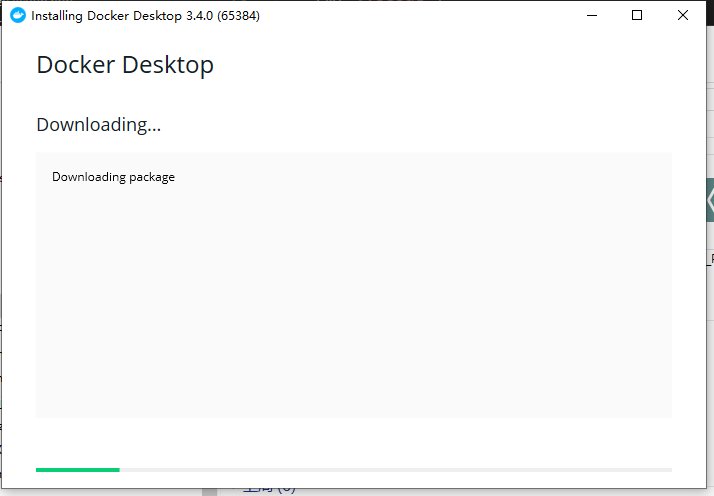
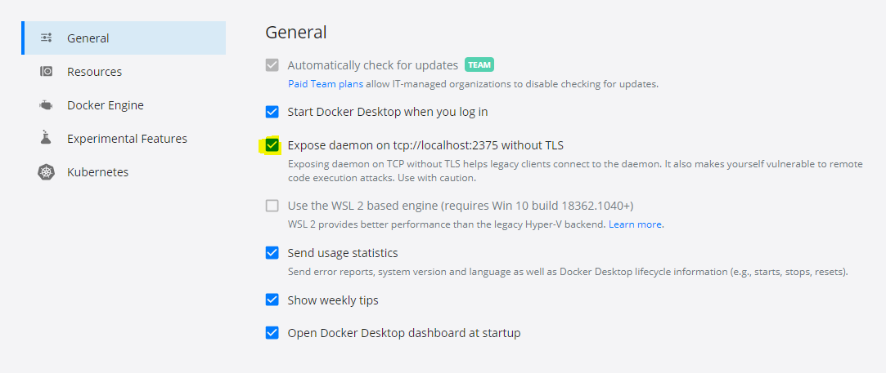
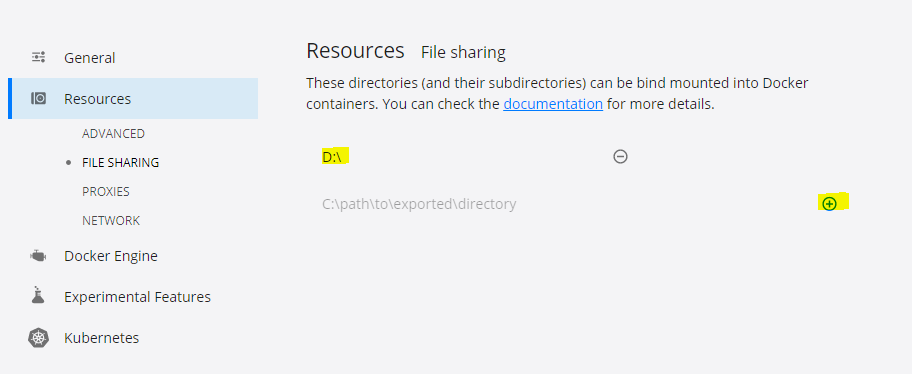
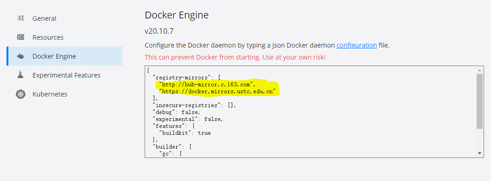
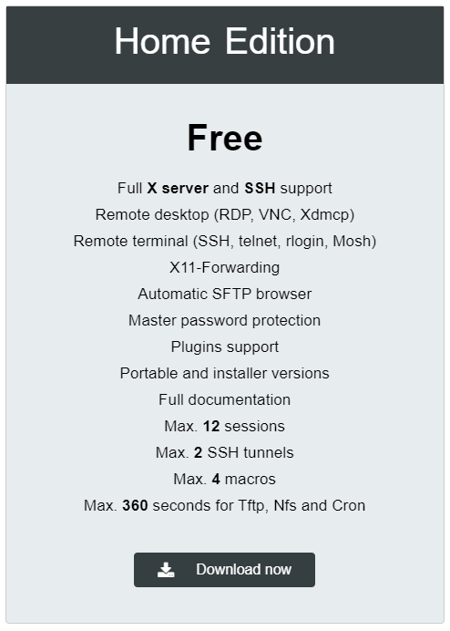
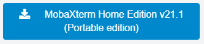
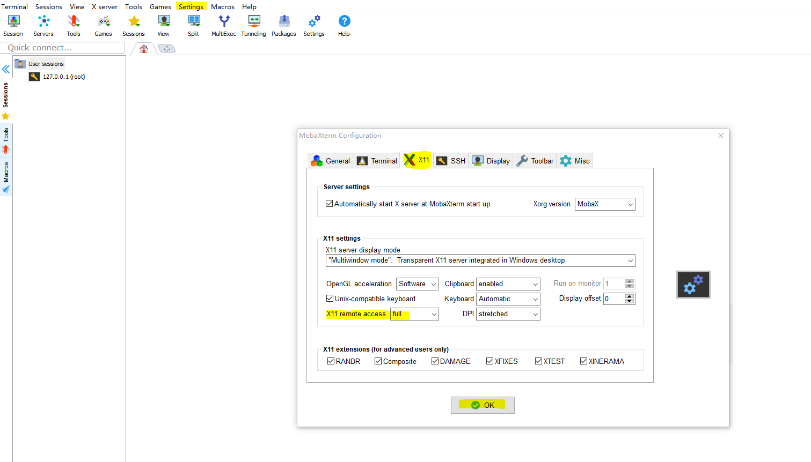
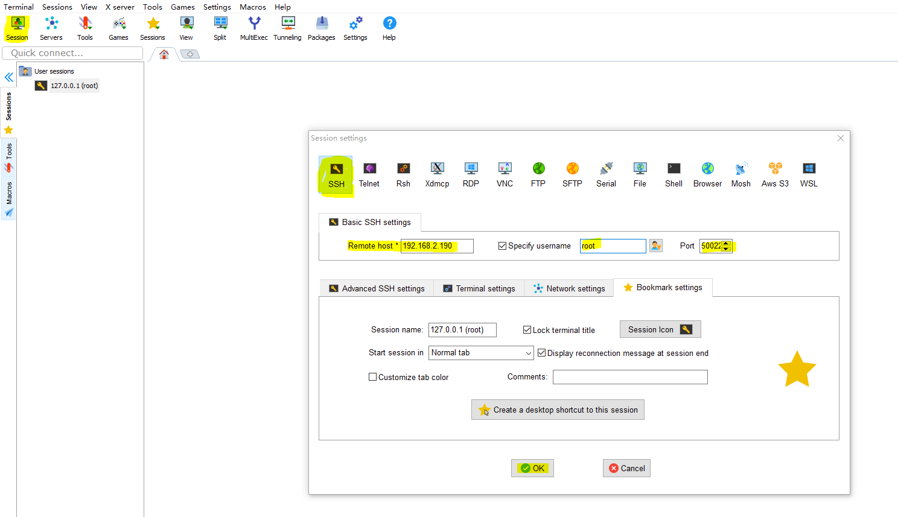
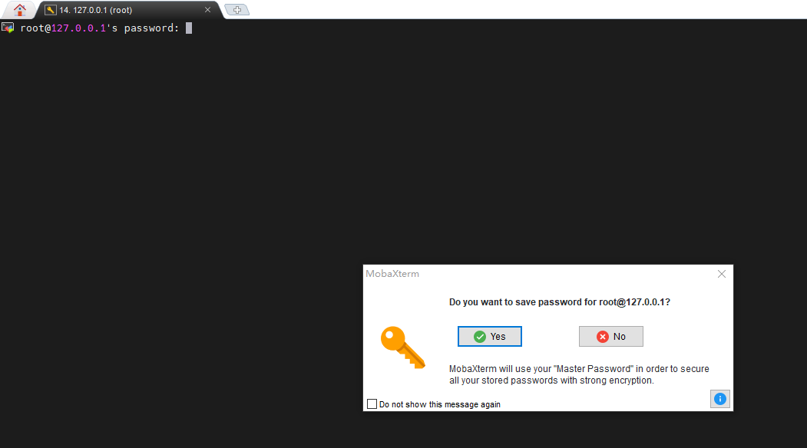
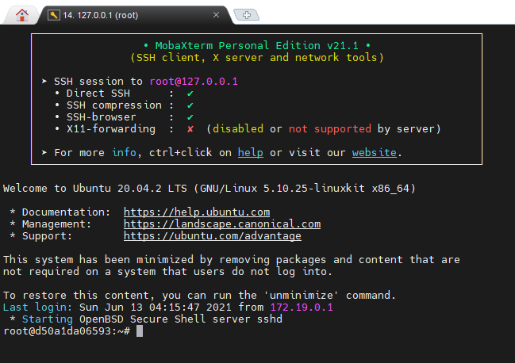

# Windows + VSCode + Docker + Ubuntu + MobaXterm 环境搭建——以 GAMES101 为例 

最近在做 `GAMES101` [https://www.bilibili.com/video/BV1X7411F744](https://www.bilibili.com/video/BV1X7411F744) 的作业，发现老师提供的虚拟机跑得比较慢，想把整个开发环境变成 `Docker`，于是记录一下怎么做。顺便研究下如何把这套方法扩展成任意的 `Windows-based Linux` 开发。

# 1. 安装并设置 `Docker`

下载 [https://www.docker.com/products/docker-desktop](https://www.docker.com/products/docker-desktop)


安装：

 
在任务栏中找到 `Docker` 徽标，右键选择 ```settings```，勾上 ```General``` 的 ```Expose daemon one tcp:://localhost:2375 without TLS``` 项。





```Resources -> File Sharing``` 点击带圆圈的 `+` 号，设定 `Docker` 与本地文件夹共享，被共享的文件夹必须覆盖 `GAMES101`，例如这里选择了 `D:/`，是 `D:/GAMES101` 的父目录。 



如果身在国内，需要把 `Docker` 源更换一下，在 `Docker Engine` 的 `json` 文件中找到 `"registry-mirrors"`, 把整个键改成：

```json
"registry-mirrors": [
    "http://hub-mirror.c.163.com",
    "https://docker.mirrors.ustc.edu.cn"
],
```



设置完成啦，按 `Apply & Restart`。


# 2. 安装 MobaXterm 可携带版

[https://mobaxterm.mobatek.net/download.html](https://mobaxterm.mobatek.net/download.html)

选 Home Edition。



选 Portable Edition 下载到任意目录中。



# 3. 安装 Python3

如使用 `run.py` 和 `clean.py` 可以安装 `Python`。
`Python` 安装在此不赘述。

下载网址 [https://www.python.org/downloads/](https://www.python.org/downloads/)


# 4. 目录结构

在某个目录下建立你的整个目录 `GAMES101`，这里用的是 `D:/GAMES101`，其目录结构应该如下。

```
|_ GAMES101
  |_ docker-compose.yml
  |_ Dockerfile
  |_ Assignment 1
    |_ 作业 1 所需的框架文件
    |_ run.py
    |_ clean.py
    |_ (可选) convert_to_jpg.py
```

作业 2 以后的如此类推，放在各自的 `Assignment` 文件夹下。
 

## 4.1 docker-compose.yml

这里基于`./Dockerfile` 的设置，把 `D:/GAMES101` 挂在容器的 `/src/` 下。暴露容器端口 `50022` 为主机端口 `22`，执行了一个睡眠了一天的命令。镜像名称为 `games101`。

```yml
version: '3.4'
services:
  games101:
    restart: unless-stopped
    image: games101:latest
    build:
      context: .
      dockerfile: ./Dockerfile
      target: base
    container_name: games101
    working_dir: /src/
    command: /bin/sh -c "sleep 1d"
    volumes:
      - ./:/src/      
    ports:
        - 50022:22
```

## 4.2 Dockerfile

详见注释。

```docker
FROM ubuntu:latest as base

# 更换Ubuntu国内源，这里根据版本号替换，20.04的版本号是 focal
RUN cp /etc/apt/sources.list /etc/apt/sources.list.bak && \
    echo "deb http://mirrors.163.com/ubuntu/ focal main restricted universe multiverse\n" > etc/apt/sources.list && \
    echo "deb http://mirrors.163.com/ubuntu/ focal-security main restricted universe multiverse\n" >> etc/apt/sources.list && \
    echo "deb http://mirrors.163.com/ubuntu/ focal-updates main restricted universe multiverse\n" >> etc/apt/sources.list && \
    echo "deb http://mirrors.163.com/ubuntu/ focal-backports main restricted universe multiverse\n" >> etc/apt/sources.list && \
    echo "deb-src http://mirrors.163.com/ubuntu/ focal main restricted universe multiverse\n" >> etc/apt/sources.list && \
    echo "deb-src http://mirrors.163.com/ubuntu/ focal-security main restricted universe multiverse\n" >> etc/apt/sources.list && \
    echo "deb-src http://mirrors.163.com/ubuntu/ focal-updates main restricted universe multiverse\n" >> etc/apt/sources.list && \
    echo "deb-src http://mirrors.163.com/ubuntu/ focal-backports main restricted universe multiverse\n" >> etc/apt/sources.list 

# 安装必要的 gcc g++ 等
RUN apt-get -y update
RUN apt-get -y install sudo
RUN sudo apt-get -y install build-essential 
RUN sudo apt-get -y install gcc-multilib 
RUN sudo apt-get -y install curl

# 安装tzdata 会出现需要命令行交互的情况，需要提早把timezone写入以避免
RUN ln -snf /usr/share/zoneinfo/$CONTAINER_TIMEZONE /etc/localtime && echo $CONTAINER_TIMEZONE > /etc/timezone
RUN sudo apt-get -y install tzdata

# 安装作业中所需的依赖和 cmake 
RUN sudo apt-get -y install cmake
RUN sudo apt-get -y install libopencv-dev 
RUN sudo apt-get -y install libeigen3-dev
RUN sudo apt-get -y install libglu1-mesa-dev 
RUN sudo apt-get -y install freeglut3-dev 
RUN sudo apt-get -y install xorg-dev  

# 设置网络
RUN sudo apt-get -y install openssh-server
RUN sudo apt-get -y install net-tools
RUN echo "Port 22" >> /etc/ssh/sshd_config
RUN echo "PermitRootLogin yes" >> /etc/ssh/sshd_config 
RUN sudo echo "service ssh start" >> /root/.bashrc
RUN sudo apt-get -y install software-properties-common 
RUN sudo apt-get -y install apt-transport-https 
RUN sudo apt-get -y install wget

# 镜像内安装 vscode，注意 192.168.2.190 应替换成宿主的ip
RUN wget -q https://packages.microsoft.com/keys/microsoft.asc -O- | sudo apt-key add -
RUN sudo add-apt-repository "deb [arch=amd64] https://packages.microsoft.com/repos/vscode stable main"
RUN sudo apt-get -y install code
RUN sudo echo "export DISPLAY=192.168.2.190:0.0" >> /root/.bashrc

# （可选）安装 vim git
RUN sudo apt-get -y install vim
RUN sudo apt-get -y install git

# （可选）ppm 转 jpg 需要用到 PIL 库
RUN sudo apt-get -y install python3
RUN sudo apt-get -y install python3-pip
RUN python3 -m pip install pillow

```


## 4.3 run.py

`run.py` 和 `clean.py` 是用来做清理工作和重新编译工作的，可以用其他格式的脚本代替。

`run.py` 用来重新编译并运行程序。


```python
import os
import shutil

def rm(path: str) -> None:
    if os.path.isfile(path):
        os.remove(path)
    elif os.path.isdir(path):
        shutil.rmtree(path)


def mkdir(path: str) -> None:
    if os.path.isfile(path):
        os.remove(path)
    os.makedirs(path, exist_ok=True)


if __name__ == '__main__':
    rm('__build__')
    mkdir('__build__')
    os.chdir('__build__')
    os.system('cmake ../')
    os.system('make')
    #os.system('./Rasterize')              # (1.)作业 1 2 3 4 5 

    #os.system('./Raytracing')             # (2.)作业 6 7
    #os.chdir('..')                        # (3.)作业 6 7
    #os.system('python convert_to_jpg.py') # (4.)作业 6 7
```

最下面四句以作业 5 为分界，分成两部分：

对于作业 1 2 3 4 5 ，请去除第 (1.) 行的**第一个**#号。其他保留不变。

对于作业 6 7 ，请去除第 (2.) (3.) (4.) 行的**第一个**#号。(1.)保留不变。

## 4.4 clean.py 

`clean.py` 用来重新删除上次编译结果和其他无用的文件。

```python
import os
import shutil

def rm(path: str) -> None:
    if os.path.isfile(path):
        os.remove(path)
    elif os.path.isdir(path):
        shutil.rmtree(path)


def mkdir(path: str) -> None:
    if os.path.isfile(path):
        os.remove(path)
    os.makedirs(path, exist_ok=True)

if __name__ == '__main__':
    rm('__build__')
    rm('.vscode')
    rm('.cache')
    rm('.mypy_cache')
    rm('compile_commands.json')

```

## 4.5 conver_to_jpg.py

在光线追踪的作业 4 5 6 中可以添加这个`conver_to_jpg.py` 把 `ppm` 文件转成 `jpg`。

```python
from PIL import Image

img = Image.open("./__build__/binary.ppm")
img.save("./__build__/binary.jpg")
img.show()
```

# 5. 跑起来！

## 5.1 Build

在 `GAMES101` 文件夹下`右键->通过 VSCode 打开`。`Ctrl + j` 调出  `Windows 终端`，输入：
```bash
docker-compose build
```

跑完之后显示以下文字，说明 build 成功了。

```
[+] Building 152.8s (34/34) FINISHED
 => [internal] load build definition from Dockerfile                                                                                                        0.5s 
 => => transferring dockerfile: 32B                                                                                                                         0.0s 
 => [internal] load .dockerignore                                                                                                                           0.8s 
 => => transferring context: 2B                                                                                                                             0.0s 
 => [internal] load metadata for docker.io/library/ubuntu:latest                                                                                            0.0s 
 => [ 1/30] FROM docker.io/library/ubuntu:latest                                                                                                            0.0s 
 => CACHED [ 2/30] RUN cp /etc/apt/sources.list /etc/apt/sources.list.bak &&     echo "deb http://mirrors.163.com/ubuntu/ focal main restricted universe m  0.0s 
 => CACHED [ 3/30] RUN apt-get -y update                                                                                                                    0.0s 
 => CACHED [ 4/30] RUN apt-get -y install sudo                                                                                                              0.0s 
 => CACHED [ 5/30] RUN sudo apt-get -y install build-essential                                                                                              0.0s 
 => CACHED [ 6/30] RUN sudo apt-get -y install gcc-multilib                                                                                                 0.0s 
 => CACHED [ 7/30] RUN sudo apt-get -y install curl                                                                                                         0.0s 
 => CACHED [ 8/30] RUN ln -snf /usr/share/zoneinfo/$CONTAINER_TIMEZONE /etc/localtime && echo $CONTAINER_TIMEZONE > /etc/timezone                           0.0s 
 => CACHED [ 9/30] RUN sudo apt-get -y install tzdata                                                                                                       0.0s 
 => CACHED [10/30] RUN sudo apt-get -y install cmake                                                                                                        0.0s 
 => CACHED [11/30] RUN sudo apt-get -y install libopencv-dev                                                                                                0.0s 
 => CACHED [12/30] RUN sudo apt-get -y install libeigen3-dev                                                                                                0.0s 
 => CACHED [13/30] RUN sudo apt-get -y install git                                                                                                          0.0s 
 => CACHED [14/30] RUN sudo apt-get -y install libglu1-mesa-dev                                                                                             0.0s 
 => CACHED [15/30] RUN sudo apt-get -y install freeglut3-dev                                                                                                0.0s 
 => CACHED [16/30] RUN sudo apt-get -y install xorg-dev                                                                                                     0.0s 
 => CACHED [17/30] RUN sudo apt-get -y install openssh-server                                                                                               0.0s 
 => CACHED [18/30] RUN sudo apt-get -y install net-tools                                                                                                    0.0s 
 => CACHED [19/30] RUN echo "Port 22" >> /etc/ssh/sshd_config                                                                                               0.0s 
 => CACHED [20/30] RUN echo "PermitRootLogin yes" >> /etc/ssh/sshd_config                                                                                   0.0s 
 => CACHED [21/30] RUN sudo echo "service ssh start" >> /root/.bashrc                                                                                       0.0s 
 => CACHED [22/30] RUN sudo apt-get -y install software-properties-common                                                                                   0.0s 
 => CACHED [23/30] RUN sudo apt-get -y install apt-transport-https                                                                                          0.0s 
 => CACHED [24/30] RUN sudo apt-get -y install wget                                                                                                         0.0s 
 => CACHED [25/30] RUN sudo apt-get -y install vim                                                                                                          0.0s 
 => CACHED [26/30] RUN sudo apt-get -y install python3                                                                                                      0.0s 
 => CACHED [27/30] RUN wget -q https://packages.microsoft.com/keys/microsoft.asc -O- | sudo apt-key add -                                                   0.0s 
 => CACHED [28/30] RUN sudo add-apt-repository "deb [arch=amd64] https://packages.microsoft.com/repos/vscode stable main"                                   0.0s 
 => [29/30] RUN sudo apt-get -y install code                                                                                                              136.5s 
 => [30/30] RUN sudo echo "export DISPLAY=192.168.2.190:0.0" >> /root/.bashrc                                                                               2.9s 
 => exporting to image                                                                                                                                     12.0s 
 => => exporting layers                                                                                                                                    10.0s 
 => => writing image sha256:567673656fadd403123f7bf7d81e6e9dbb23b03bf3d40f4a1f9275e57b06fb23                                                                0.1s 
 => => naming to docker.io/library/games101:latest                                                                                                          0.1s 

```

使用以下命令进入容器：
```
docker-compose up
```

会发现已经进入了容器。
```
D:\GAMES101>docker-compose up
[+] Running 2/2
 - Network 101_default  Created                                                                                                                             3.5s 
 - Container games101   Created                                                                                                                             1.0s 
Attaching to games101
```


此时**另起一个 `VSCode Windows` 终端**，一定要另起一个，输入：

```
docker-compose exec games101 bash
```

因为之前的设置`RUN sudo echo "service ssh start" >> /root/.bashrc`，会发现容器内已经启动了 `sshd`。
```
D:\GAMES101>docker-compose exec games101 bash
 * Starting OpenBSD Secure Shell server sshd                                                                                                              [ OK ] 
root@d50a1da06593:/src#
```


接下来在容器内的终端设置容器内的密码，以便 `MobaXterm` 连入：

```bash
passwd
```

回车后会让你输入密码，输入后回车，会让你再输入一次。再输入这个密码，回车。
```bash
New password: 
Retype new password:
passwd: password updated successfully
```

## 5.2 设置 `MobaXterm`

使用 `MobaXterm` 的原因是因为里面自带一个 `XServer`，可以展示可视化应用。打开 `MobaXterm`，先进行设置。`settings -> X11 -> X11 remote access` 设为 `full` -> `OK`。



然后 `Sessions -> SSH`，在 `Remote Host` 中填入宿主的 IP 或`127.0.0.1`，用户名填 `root`，`port` 填 `50022`。这样设置的原因是，`Docker` 容器在设置时把端口 `22` 暴露给宿主的 `50022`，所以与宿主的 `50022` 端口通讯相当于与容器的 `22` 端口通讯。 



注意，此前 `Dockerfile` 中 `RUN sudo echo "export DISPLAY=192.168.2.190:0.0" >> /root/.bashrc` 这个地方的 `192.168.2.190` 须替换成宿主的 IP，查看宿主 IP 的方法是在 `Windows 命令行`下输入 `ipconfig` 命令。如果不是，请修改 `Dockerfile` 并重新执行第 5.1 步 `docker-compose build`。这里的设置能把容器内的应用显示通过 `MobaXterm` 的 `XServer` 转发到宿主的屏幕上。

## 5.3 连接 MobaXterm 到容器

按 `OK` 后，就可以打开这个连接了。途中会让你输入密码，这就是之前在第 5.1 步中设置的密码，输入后会询问你保不保存，选哪个都不影响。



连上啦



## 5.4 在容器内打开 VSCode

这一步非必须。

打开 `VSCode`，安装 `Remote Development` 扩展。


安装 `Docker` 扩展。


在左边的 Docker 扩展栏中会发现 `CONTAINERS` 里有一个正在运行的容器，右键点击 `Attach Visual Studio Code`，就可以在容器内的环境开发啦。


# 6. 写完代码的运行

在第 5 步的基础上开发 Assignment 1，按 4.3 设置好 `run.py`，然后在容器的终端内运行：

```bash
python3 run.py
```

就能跑啦。
```bash
root@d50a1da06593:/src/1# python3 run.py
-- The C compiler identification is GNU 9.3.0
-- The CXX compiler identification is GNU 9.3.0
-- Check for working C compiler: /usr/bin/cc
-- Check for working C compiler: /usr/bin/cc -- works
-- Detecting C compiler ABI info
-- Detecting C compiler ABI info - done
-- Detecting C compile features
-- Detecting C compile features - done
-- Check for working CXX compiler: /usr/bin/c++
-- Check for working CXX compiler: /usr/bin/c++ -- works
-- Detecting CXX compiler ABI info
-- Detecting CXX compiler ABI info - done
-- Detecting CXX compile features
-- Detecting CXX compile features - done
-- Found OpenCV: /usr (found version "4.2.0") 
-- Configuring done
-- Generating done
-- Build files have been written to: /src/1/build
Scanning dependencies of target Rasterizer
[ 25%] Building CXX object CMakeFiles/Rasterizer.dir/main.cpp.o
[ 50%] Building CXX object CMakeFiles/Rasterizer.dir/rasterizer.cpp.o
[ 75%] Building CXX object CMakeFiles/Rasterizer.dir/Triangle.cpp.o
[100%] Linking CXX executable Rasterizer
[100%] Built target Rasterizer
```


# 7 总结

这套方法不止适用于 `GAMES101` 的环境搭建，还可以用来做一些代码必须在 `Linux` 平台运行，但是手上只有 `Windows` 机器的情况，具体可根据实际情况调整。